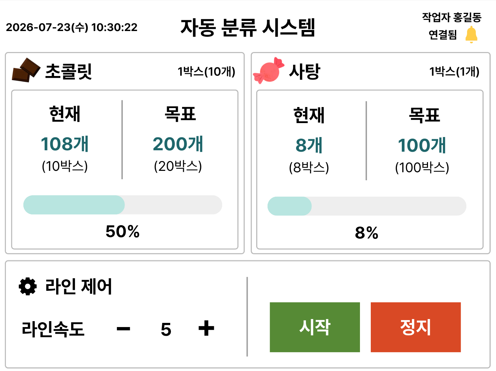
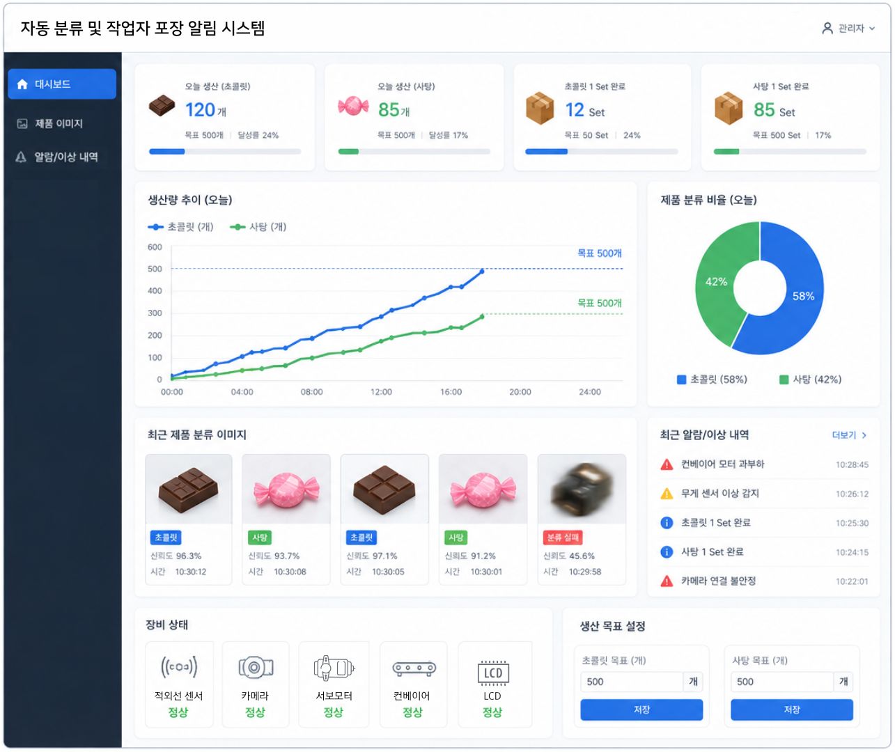
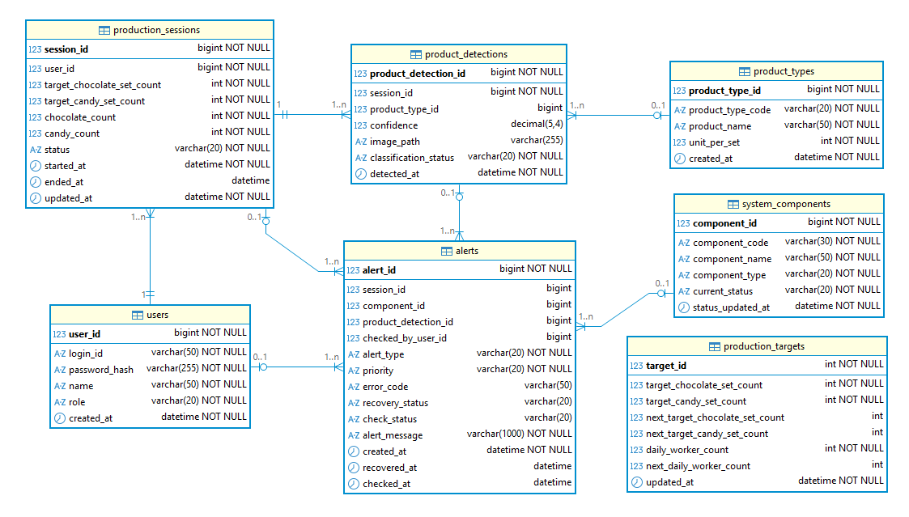
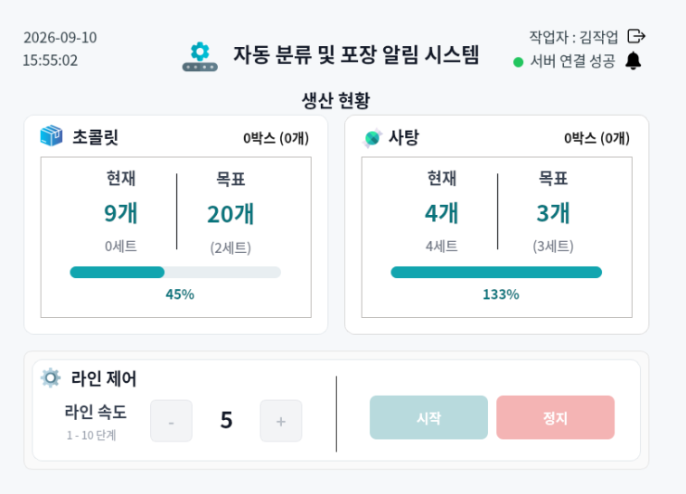
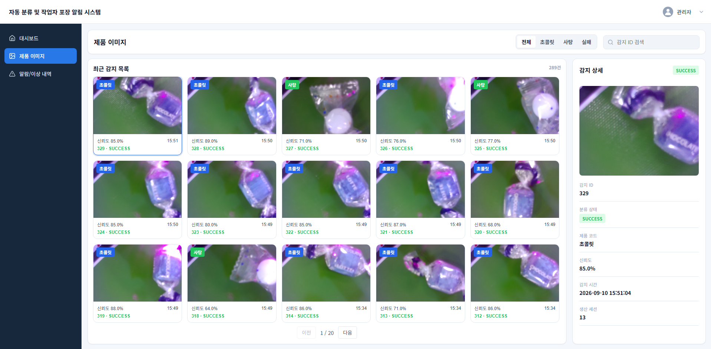
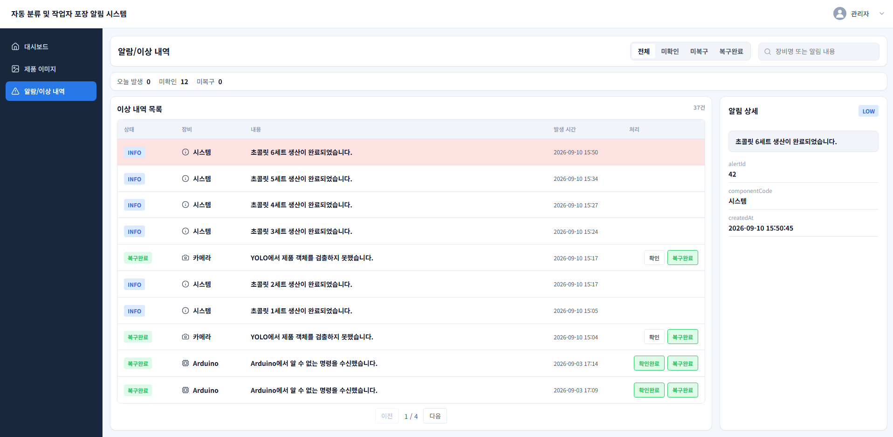

# 🍫 초콜릿·사탕 자동 분류 및 생산 모니터링 시스템

## 1. 프로젝트 개요

### 1.1 프로젝트 소개

본 프로젝트는 컨베이어벨트를 기반으로 초콜릿과 사탕을 자동으로 감지하고 분류하며, 제품의 생산량과 장비 상태를 실시간으로 관리할 수 있는 **IoT 기반 자동 생산 시스템**이다.

적외선 센서를 이용하여 컨베이어벨트 위의 제품을 감지하고, Raspberry Pi Camera로 제품 이미지를 촬영한 뒤 **YOLO 기반 객체 인식**을 이용하여 초콜릿과 사탕을 자동으로 구분한다.

분류 결과는 Raspberry Pi에서 처리되며, Arduino와 Serial 통신하여 서보모터와 컨베이어 등 분류 장치를 제어한다. 제품 이미지와 분류 결과, 장비 상태는 REST API와 MQTT를 통해 ASP.NET Core Backend와 연동하고 MySQL 데이터베이스에 저장한다.

작업자용 **PyQt5 UI**에서는 현재 생산량, 목표 생산량, 진행률, 장비 상태와 알림을 확인하고 컨베이어벨트를 제어할 수 있으며, 관리자용 Web에서는 생산 현황, 제품 분류 결과, 알림 및 장비 상태를 확인할 수 있도록 구성하였다.

---

### 1.2 개발 배경 및 필요성

기존의 생산 및 포장 공정에서는 제품의 분류와 수량 확인을 작업자가 직접 수행하는 경우가 많아 반복적인 작업에 많은 인력이 필요하다.

특히 제품의 종류가 다양해질수록 작업자의 판단에 의존한 수작업 분류 과정에서 다음과 같은 문제가 발생할 수 있다.

- 제품 분류 과정에서의 작업자 실수
- 생산량 및 포장 수량 확인에 필요한 시간 증가
- 생산 현황을 실시간으로 확인하기 어려움
- 장비 이상 발생 시 즉각적인 대응 어려움
- 생산 데이터를 체계적으로 기록하고 관리하기 어려움

이러한 문제를 해결하기 위해 센서, 카메라, 컨베이어벨트, 마이크로컨트롤러 및 서버를 연동하여 제품 감지부터 분류, 생산량 집계, 장치 제어 및 모니터링까지 자동화하는 시스템을 개발하였다.

---

### 1.3 프로젝트 목표

본 프로젝트의 주요 목표는 다음과 같다.

- 적외선 센서를 이용한 제품 자동 감지
- 카메라를 이용한 제품 이미지 촬영
- YOLO를 이용한 초콜릿 및 사탕 자동 분류
- 분류 결과에 따른 컨베이어 및 서보모터 제어
- 제품별 생산량 실시간 집계
- 목표 생산량 및 생산 진행률 관리
- 작업자 UI를 통한 생산 상태 및 장비 상태 확인
- 관리자 Web을 통한 실시간 생산 모니터링
- 제품 이미지 및 분류 결과 저장
- 생산 데이터 및 오류 이력 데이터베이스 관리
- 생산 과정에서 발생하는 장비 오류 및 이상 상황 기록

---

### 1.4 팀원 및 역할

| 이름 | 역할 | 담당 업무 |
|------|------|-----------|
| 하서영 | 팀장 / 시스템 통합 및 연동 | 시스템 전체 구조 설계, 통합 테스트 및 오류 수정 |
| 김채현 | 프론트엔드 / 웹 | 관리자 웹 페이지 개발, 생산 현황 및 통계 화면 구현, 장비 상태 및 알림 화면 구현 |
| 김민주 | 백엔드 / 데이터베이스 | ASP.NET Core Backend 개발, REST API 구현, MQTT 연동, MySQL 데이터베이스 설계 및 연동, 생산·분류·알림 데이터 관리 |
| 박소영 | PyQt5 / 작업자 UI | PyQt5 기반 작업자 UI 개발, 생산량 및 목표량 표시, 장비 상태 및 알림 화면 구현 |
| 한동현 | IoT / 하드웨어 | Arduino 및 Raspberry Pi 제어, 센서·카메라·컨베이어·서보모터 연동, LCD·부저 제어 |

---

## 2. 요구사항 및 설계

### 2.1 요구사항 정의

본 시스템은 작업자와 관리자로 사용자를 구분하며, 사용자 권한에 따라 사용할 수 있는 기능을 구분한다.

#### 작업자

- 생산 작업 시작 및 종료
- 컨베이어벨트 제어
- 생산량 확인
- 목표 생산량 확인
- 생산 진행률 확인
- 장비 연결 상태 확인
- 생산 완료 및 이상 상황 알림 확인

#### 관리자

- 실시간 생산 현황 확인
- 제품 분류 결과 확인
- 제품 촬영 이미지 확인
- 생산 통계 확인
- 장비 상태 확인
- 오류 및 알림 내역 확인
- 생산 목표 및 작업 인원 설정

---

### 2.2 기능 요구사항

| ID | 기능 | 설명 | 우선순위 |
|----|------|------|----------|
| FR-01 | 로그인 | 작업자 및 관리자 로그인 | 높음 |
| FR-02 | 로그아웃 | 로그인 사용자 로그아웃 | 중간 |
| FR-03 | 권한 구분 | 작업자와 관리자 권한 구분 | 높음 |
| FR-04 | 물체 감지 | 적외선 센서를 이용한 제품 감지 | 높음 |
| FR-05 | 이미지 촬영 | 제품 감지 시 카메라 촬영 | 높음 |
| FR-06 | 제품 분류 | YOLO를 이용한 초콜릿 및 사탕 분류 | 높음 |
| FR-07 | 컨베이어 제어 | 컨베이어 시작, 정지 및 속도 제어 | 높음 |
| FR-08 | 자동 분류 | 분류 결과에 따른 장치 제어 | 높음 |
| FR-09 | 생산량 집계 | 제품별 생산량 실시간 집계 | 높음 |
| FR-10 | 작업자 UI | 생산량 및 장비 상태 표시 | 높음 |
| FR-11 | 이상 알림 | 센서 및 장비 이상 알림 | 높음 |
| FR-12 | 실시간 모니터링 | 관리자 웹에서 생산 현황 확인 | 높음 |
| FR-13 | 분류 결과 | 이미지 및 분류 신뢰도 확인 | 높음 |
| FR-14 | 생산 통계 | 목표 및 실제 생산량 통계 확인 | 중간 |
| FR-15 | 데이터 저장 | 생산 및 분류 데이터를 DB에 저장 | 중간 |

---

### 2.3 비기능 요구사항

- 제품 감지 후 분류 결과를 빠르게 처리할 수 있어야 한다.
- 생산 현황은 실시간으로 갱신되어야 한다.
- 센서, 카메라, 컨베이어 등의 장비가 안정적으로 동작해야 한다.
- 장비 이상 발생 시 작업자와 관리자에게 알림을 제공해야 한다.
- 사용자 비밀번호는 평문으로 저장하지 않아야 한다.
- 작업자와 관리자의 접근 권한을 구분해야 한다.
- 각 기능은 유지보수가 가능하도록 역할별로 분리하여 개발한다.
- Arduino, Raspberry Pi, Backend Server 및 클라이언트 간 통신이 정상적으로 이루어져야 한다.

---

### 2.4 UI 설계

#### 작업자 화면

작업자 화면은 생산 현장에서 현재 생산 상태를 빠르게 확인하고 장비를 제어할 수 있도록 구성하였다.

주요 표시 정보는 다음과 같다.

- 현재 날짜 및 시간
- 작업자 정보
- 서버 및 장비 연결 상태
- 초콜릿 생산량
- 사탕 생산량
- 목표 생산량
- 생산 진행률
- 컨베이어 속도
- 생산 시작 및 정지
- 알림



#### 관리자 화면

관리자 화면은 생산 현황 및 장비 상태를 통합적으로 확인할 수 있는 웹 대시보드 형태로 구성하였다.

주요 메뉴는 다음과 같다.

- 대시보드
- 제품 이미지
- 알림 및 이상 내역
- 장비 상태 및 생산 현황



---

### 2.5 데이터베이스 설계

본 프로젝트의 데이터베이스는 생산 목표, 작업자별 생산 작업, 개별 제품 감지 및 분류 결과, 시스템 구성요소 상태, 알림 이력을 관리하도록 설계하였다.

MySQL을 사용하며, 생산 작업을 중심으로 각 데이터가 연결되도록 구성하였다.

#### 2.5.1 주요 테이블

| 테이블 | 설명 |
|---|---|
| `users` | 관리자 및 작업자 계정과 권한 관리 |
| `product_types` | 제품 유형 및 세트 구성 기준 관리 |
| `system_components` | 센서, 카메라, 컨베이어 등 시스템 구성요소 상태 관리 |
| `production_targets` | 하루 전체 생산 목표 및 작업 인원 관리 |
| `production_sessions` | 작업자별 생산 작업 및 생산량 관리 |
| `product_detections` | 개별 제품의 감지 및 분류 결과 관리 |
| `alerts` | 생산 및 시스템에서 발생한 정보, 경고, 오류 이력 관리 |

상세 컬럼, 제약조건, 관계 및 처리 규칙은 아래 문서에서 확인할 수 있다.

- [`database/DATABASE_DESIGN.md`](./database/DATABASE_DESIGN.md)
- [`docs/03-database-design.md`](./docs/03-database-design.md)

#### 2.5.2 ERD

프로젝트의 데이터베이스 구조와 테이블 간 관계는 다음 ERD를 기준으로 설계하였다.



관련 파일:

- [`database/smart_sorting_system.sql`](./database/smart_sorting_system.sql)
- [`database/smart_sorting_system.erd`](./database/smart_sorting_system.erd)
- [`database/smart_sorting_system_erd.png`](./database/smart_sorting_system_erd.png)
- [`database/smart_sorting_system_dbeaver_erd.png`](./database/smart_sorting_system_dbeaver_erd.png)

#### 2.5.3 데이터 처리 개요

```text
사용자 로그인
    ↓
생산 작업 시작
    ↓
production_sessions 생성
    ↓
적외선 센서 제품 감지
    ↓
Raspberry Pi Camera 촬영
    ↓
YOLO 제품 분류
    ↓
제품 이미지 업로드 / MQTT 분류 결과 전달
    ↓
ASP.NET Core Backend
    ↓
product_detections 저장
    ↓
production_sessions 생산량 갱신
    ↓
MySQL Database
    ↓
작업자 PyQt5 / 관리자 Web 반영
```

장비 상태 및 오류는 `system_components`와 `alerts`를 통해 관리하며, 상세 처리 규칙은 데이터베이스 설계 문서를 참고한다.

---

## 3. 개발환경 구축

### 3.1 개발환경 개요

본 프로젝트는 IoT 제어부, Backend Server, 데이터베이스, 작업자 UI 및 관리자 Web으로 구성하였다.

Raspberry Pi는 제품 감지·촬영·YOLO 분류를 수행하며, Arduino는 실제 장치 제어를 담당한다. Backend Server는 REST API와 MQTT를 통해 각 구성요소를 연결하고 데이터를 저장한다.

### 3.2 개발환경

| 구분 | 사용 기술 |
|---|---|
| 작업자 UI | Python, PyQt5 |
| Backend | C#, ASP.NET Core |
| 관리자 Web | HTML, CSS, JavaScript |
| 이미지 처리 / 분류 | Python, OpenCV, YOLO |
| 데이터베이스 | MySQL, Entity Framework Core |
| IoT 제어 | Arduino, Raspberry Pi |
| 카메라 | Raspberry Pi Camera, Picamera2 |
| 통신 | MQTT, REST API, Serial |
| 인증 | JWT, BCrypt |
| 협업 | Git, GitHub |
| 개발 도구 | Visual Studio, VS Code, Arduino IDE |
| API 테스트 | Postman |
| DB 관리 | DBeaver |
| 문서 관리 | Markdown |

---

### 3.3 GitHub 저장소 구성

프로젝트의 소스 코드와 문서는 GitHub를 이용하여 관리하였다.

```text
iot-project-2026
│
├── README.md
├── database
│   ├── DATABASE_DESIGN.md
│   ├── smart_sorting_system.sql
│   └── ...
├── docs
│   ├── 01-requirements.md
│   ├── 02-ui-design.md
│   ├── 03-database-design.md
│   ├── API_MQTT_INTERFACE.md
│   └── 시스템 아키텍처.png
├── images
│   └── README 스크린샷
├── src
│   ├── SmartSortingServer
│   └── SortingMainCode
└── 회의록
```

세부 요구사항과 UI 설계 문서는 아래에서 확인할 수 있다.

- [`docs/01-requirements.md`](./docs/01-requirements.md)
- [`docs/02-ui-design.md`](./docs/02-ui-design.md)

---

### 3.4 통신 구조

본 시스템은 기능의 성격에 따라 REST API와 MQTT를 구분하여 사용한다.

- **REST API**: 로그인, 조회, 설정, 생산 작업 제어, 이력 확인, 이미지 업로드
- **MQTT**: 제품 감지 결과, 생산 현황, 장비 상태, 알림 등 실시간 이벤트 전달

#### REST API

##### 인증

| Method | Endpoint | 용도 |
|---|---|---|
| `POST` | `/api/auth/login` | 로그인 및 JWT 발급 |
| `GET` | `/api/auth/test` | JWT 인증 확인 |

##### 생산 목표 및 작업 인원

| Method | Endpoint | 용도 |
|---|---|---|
| `GET` | `/api/production-targets/current` | 현재 및 예약 생산 목표 조회 |
| `PUT` | `/api/production-targets/current` | 생산 목표 설정 |
| `PUT` | `/api/production-targets/worker-count` | 하루 작업 인원 설정 |

##### 생산 작업

| Method | Endpoint | 용도 |
|---|---|---|
| `POST` | `/api/production-sessions/start` | 생산 작업 시작 |
| `GET` | `/api/production-sessions/current` | 현재 생산 작업 조회 |
| `PATCH` | `/api/production-sessions/finish` | 현재 생산 작업 종료 |

##### Dashboard

| Method | Endpoint | 용도 |
|---|---|---|
| `GET` | `/api/dashboard/summary` | 오늘 생산량 및 요약 조회 |
| `GET` | `/api/dashboard/hourly-production` | 시간대별 생산량 조회 |
| `GET` | `/api/dashboard/classification-ratio` | 제품 분류 비율 조회 |
| `GET` | `/api/dashboard/recent-detections` | 최근 제품 감지 결과 조회 |

##### 제품 감지 및 이미지

| Method | Endpoint | 용도 |
|---|---|---|
| `GET` | `/api/product-detections` | 제품 감지 목록 조회 |
| `GET` | `/api/product-detections/{id}` | 제품 감지 상세 조회 |
| `POST` | `/api/product-images` | 제품 이미지 업로드 |

##### 알림 및 시스템 구성요소

| Method | Endpoint | 용도 |
|---|---|---|
| `GET` | `/api/alerts` | 알림 목록 조회 |
| `GET` | `/api/alerts/summary` | 알림 요약 통계 조회 |
| `GET` | `/api/alerts/{alertId}` | 알림 상세 조회 |
| `PATCH` | `/api/alerts/{alertId}/check` | 알림 확인 처리 |
| `PATCH` | `/api/alerts/{alertId}/recover` | 알림 복구 처리 |
| `GET` | `/api/system-components` | 장비 및 시스템 상태 조회 |
| `PATCH` | `/api/system-components/{componentCode}/status` | 구성요소 상태 변경 |

#### MQTT

##### Raspberry Pi → Server

| Topic | 용도 |
|---|---|
| `smart_sorting/camera/product_detection` | 제품 감지 및 분류 결과 전달 |
| `smart_sorting/component/status/update` | 장비 상태 및 Error Code 전달 |

##### Server → 관리자 Web

| Topic | 용도 |
|---|---|
| `smart_sorting/production/status` | 생산 상태·생산량·진행률 전달 |
| `smart_sorting/product/detection` | 신규 제품 감지 결과 전달 |
| `smart_sorting/alert` | 신규 알림 전달 |
| `smart_sorting/component/status` | 장비 상태 변경 전달 |

##### Server → 작업자 Qt

작업자 Qt는 Server가 Publish하는 MQTT Topic을 Subscribe하여
생산 현황, 알림 및 장비 상태를 실시간으로 반영한다.

| Topic | 용도 |
|---|---|
| `smart_sorting/production/status` | 현재 생산량, 목표 생산량, 세트 수 및 진행률 수신 |
| `smart_sorting/alert` | 작업자용 알림 메시지 수신 |
| `smart_sorting/component/status` | 장비 상태 변경 수신 |

REST API 요청·응답 형식과 MQTT 메시지 구조는 아래 문서를 참고한다.

- [`docs/API_MQTT_INTERFACE.md`](./docs/API_MQTT_INTERFACE.md)


---

## 4. 실제 개발

### 4.1 기능별 담당

실제 구현은 팀원별 역할에 따라 진행하였으며, 세부 담당은 [1.4 팀원 및 역할](#14-팀원-및-역할)에 정리하였다.

### 4.2 로그인 기능 개발

작업자와 관리자의 계정을 구분하여 시스템 접근 권한을 관리하도록 구현하였다.

사용자가 로그인 화면에서 아이디와 비밀번호를 입력하면 Backend API가 사용자 정보를 확인하고, BCrypt로 저장된 비밀번호 해시를 검증한다. 로그인 성공 시 JWT를 발급하며 사용자 역할에 따라 작업자 UI 또는 관리자 Web에서 기능을 사용할 수 있다.

```text
로그인
  ↓
ID / Password 입력
  ↓
Backend API 요청
  ↓
USERS 조회
  ↓
BCrypt 비밀번호 검증
  ↓
JWT 발급
  ↓
권한별 화면 접근
```

### 4.3 적외선 센서 감지 기능 개발

컨베이어벨트 위로 제품이 지나갈 때 적외선 센서를 이용하여 제품의 존재 여부를 감지하도록 구현하였다.

제품 감지 신호는 Arduino에서 처리하고 Raspberry Pi로 전달하며, 이후 제품 촬영 및 분류 과정을 수행한다.

### 4.4 카메라 촬영 및 이미지 저장 기능 개발

제품 감지 후 Raspberry Pi Camera를 이용하여 제품 이미지를 촬영한다.

촬영된 이미지는 Raspberry Pi 내부에서 YOLO 분류에 사용하며, 분류 결과와 연결할 수 있도록 Backend의 이미지 업로드 API를 통해 저장한다.

### 4.5 YOLO 기반 제품 분류 기능 개발

Raspberry Pi에서 YOLO 모델을 사용하여 촬영된 이미지를 초콜릿 또는 사탕으로 분류한다.

```text
Camera
  ↓
Image
  ↓
YOLO
  ↓
Chocolate / Candy
  ↓
Confidence
```

분류 결과에는 제품 종류, 분류 신뢰도, 이미지 경로, 분류 성공 여부가 포함되며 MQTT를 통해 Backend로 전달한다.

### 4.6 자동 분류 기능 개발

YOLO 분류 결과에 따라 Raspberry Pi가 Arduino에 Serial 명령을 전달하고, Arduino는 서보모터 및 컨베이어 장치를 제어한다.

```text
제품 감지
   ↓
이미지 촬영
   ↓
YOLO 분류
   ↓
Raspberry Pi
   ↓ Serial
Arduino
   ↓
Servo / Conveyor 제어
```

### 4.7 생산량 집계 기능 개발

제품이 정상적으로 분류되면 제품 종류에 따라 현재 생산 세션의 생산량을 증가시킨다.

- 초콜릿: 생산된 낱개 수를 기준으로 집계
- 사탕: 생산된 낱개 수를 기준으로 집계
- 세트 수: `product_types.unit_per_set` 기준으로 계산

생산량 데이터는 `production_sessions`를 기준으로 관리하며 데이터베이스에 저장한다.

### 4.8 작업자 PyQt5 UI 개발

작업자 UI는 생산 현장에서 필요한 정보를 빠르게 확인하고 장비를 제어할 수 있도록 PyQt5로 구현하였다.

주요 기능:

- 작업자 로그인
- 현재 생산량 및 목표량 표시
- 생산 진행률 표시
- 컨베이어 속도 확인 및 제어
- 생산 시작 / 종료
- 장비 연결 상태 확인
- 알림 확인

### 4.9 관리자 Web 개발

관리자 Web에서는 생산 현황을 한눈에 확인할 수 있도록 대시보드 형태로 구현하였다.

주요 기능:

- 오늘 누적 생산량 및 목표 달성률
- 시간대별 생산량 확인
- 제품 분류 결과 및 이미지 조회
- 분류 신뢰도 확인
- 알림 및 이상 내역 조회
- 장비 상태 확인
- 생산 목표 및 작업 인원 관리

### 4.10 GitHub 협업 및 버전 관리

프로젝트 소스 코드와 문서는 GitHub Organization Repository를 통해 관리하였다.

기능 구현 과정에서는 Git을 이용해 변경 이력을 관리하고, 팀원별 작업 내용을 통합하였다.

---

## 5. 테스트

### 5.1 테스트 개요

각 기능의 개발이 완료된 후 실제 장비와 소프트웨어를 연동하여 통합 테스트를 진행하였다.

```text
로그인
  ↓
생산 시작
  ↓
제품 투입
  ↓
센서 감지
  ↓
카메라 촬영
  ↓
YOLO 분류
  ↓
장치 제어
  ↓
생산량 증가
  ↓
DB 저장
  ↓
작업자 UI / 관리자 Web 반영
  ↓
알림 및 상태 확인
```

### 5.2 주요 기능 테스트 결과

| 테스트 항목 | 결과 |
|---|---|
| 작업자 / 관리자 로그인 | PASS |
| 센서 제품 감지 | PASS |
| 카메라 촬영 | PASS |
| YOLO 제품 분류 | PASS |
| 분류 결과 기반 장치 제어 | PASS |
| 생산량 집계 | PASS |
| 작업자 UI 생산 현황 표시 | PASS |
| 관리자 Web 생산 현황 조회 | PASS |
| 제품 이미지 및 분류 결과 조회 | PASS |
| 장비 상태 조회 | PASS |
| 알림 조회 및 처리 | PASS |
| 데이터베이스 저장 | PASS |

---

## 6. 테스트 결과

통합 테스트를 통해 제품 감지부터 이미지 촬영, YOLO 분류, 장치 제어, 생산량 집계, 데이터베이스 저장 및 사용자 화면 반영까지 전체 흐름이 연동되는 것을 확인하였다.

```text
[제품 투입]
   ↓
[센서 감지]
   ↓
[카메라 촬영]
   ↓
[YOLO 분류]
   ↓
[제품 자동 분류]
   ↓
[생산량 집계]
   ↓
[DB 저장]
   ↓
[작업자 UI / 관리자 Web]
   ↓
[장비 상태 및 알림 확인]
```

---

## 7. 트러블 슈팅

### 7.1 센서 중복 감지 문제

**문제**  
제품 하나가 센서를 통과할 때 센서 신호가 여러 번 발생하여 하나의 제품이 중복 처리될 수 있었다.

**원인**  
제품이 센서 앞에 머무는 동안 감지 신호가 반복적으로 발생하였다.

**해결**  
제품 처리 중에는 추가 감지를 제한하고, 처리 완료 후 다시 감지를 허용하도록 제어하였다.

**결과**  
제품 한 개당 한 번의 분류 과정이 수행되도록 개선하였다.

### 7.2 카메라 촬영 타이밍 문제

**문제**  
센서 감지 직후 촬영할 경우 제품이 카메라 촬영 위치에 도달하기 전에 이미지가 촬영되는 문제가 있었다.

**원인**  
센서 위치와 카메라 위치 사이에 물리적인 거리가 존재하였다.

**해결**  
센서 감지 이후 제품이 촬영 위치에 도달한 시점에 촬영하도록 동작 순서를 조정하였다.

**결과**  
제품이 정상적인 위치에서 촬영되도록 개선하였다.

### 7.3 제품 분류 안정성 문제

**문제**  
촬영 환경과 제품 위치에 따라 분류 결과가 달라질 수 있었다.

**해결**  
촬영 위치와 환경을 조정하고 YOLO 모델의 신뢰도 기준을 적용하여 분류 결과를 처리하였다.

**결과**  
분류 결과의 안정성을 높이고, 기준 이하의 결과는 실패 상태로 처리할 수 있도록 구성하였다.

### 7.4 생산 데이터 동기화

**문제**  
장치 측 생산 상태와 사용자 화면에서 표시되는 데이터를 일관되게 유지할 필요가 있었다.

**해결**  
제품 감지 결과는 Backend를 통해 데이터베이스에 저장하고, 생산 상태는 REST API와 MQTT를 이용해 작업자 UI와 관리자 Web에 전달하도록 구성하였다.

**결과**  
생산 데이터의 기준을 Backend와 Database 중심으로 통합하였다.

---

## 8. 프로젝트 실행 방법

### 8.1 사전 준비

다음 프로그램 및 장비가 필요하다.

```text
Visual Studio
.NET SDK
Python
MySQL
Arduino IDE
Raspberry Pi
Raspberry Pi Camera
적외선 센서
LCD
Buzzer
Servo Motor
Conveyor Belt
```

### 8.2 데이터베이스 실행

MySQL을 실행한 후 아래 스크립트를 이용하여 데이터베이스와 테이블을 구성한다.

- [`database/smart_sorting_system.sql`](./database/smart_sorting_system.sql)

### 8.3 Backend 실행

`src/SmartSortingServer`의 ASP.NET Core 프로젝트를 실행한다.

Backend 실행 전 DB 연결 및 JWT, MQTT 관련 설정값을 환경에 맞게 구성해야 한다.

### 8.4 Raspberry Pi 실행

Raspberry Pi에서 카메라, YOLO 모델, Serial 및 MQTT 연결을 확인한 후 아래 메인 프로그램을 실행한다.

- `src/SortingMainCode/main/main.py`

### 8.5 Arduino 실행

Arduino에 아래 스케치를 업로드한 후 센서, 컨베이어 및 서보모터의 연결 상태를 확인한다.

- `src/SortingMainCode/main/arduino/sorting_system/sorting_system.ino`

### 8.6 작업자 UI 실행

Raspberry Pi 작업자 환경에서 PyQt5 기반 작업자 프로그램을 실행한다.

- `src/SortingMainCode/main/worker/login.py`
- `src/SortingMainCode/main/worker/main.py`

### 8.7 전체 시스템 실행 순서

```text
1. MySQL 실행
        ↓
2. ASP.NET Core Backend 실행
        ↓
3. Arduino / Raspberry Pi 실행
        ↓
4. 작업자 PyQt5 UI 실행
        ↓
5. 관리자 Web 접속
        ↓
6. 작업자 로그인 및 생산 시작
        ↓
7. 제품 투입
        ↓
8. 자동 분류 및 생산량 집계
```

---

## 9. 스크린샷 및 시연영상

### 9.1 작업자 UI

작업자가 생산량과 목표 생산량을 확인하고 컨베이어벨트를 제어할 수 있는 화면이다.



### 9.2 관리자 Dashboard

관리자가 전체 생산 현황과 장비 상태를 확인할 수 있는 화면이다.


### 9.3 제품 분류 화면

카메라로 촬영한 제품 이미지와 YOLO 분류 결과 및 신뢰도를 확인할 수 있는 화면이다.



### 9.4 알림 및 이상 상태 관리 화면

시스템 및 장비에서 발생한 알림과 이상 내역을 확인하고, 발생 시간과 확인·복구 상태 및 상세 정보를 조회할 수 있는 화면이다.



### 9.5 IoT 장비

컨베이어벨트, 적외선 센서, 카메라, LCD, 부저 및 서보모터로 구성된 실제 장비이다.


### 9.6 시연영상

https://github.com/user-attachments/assets/9cb9f355-9547-4d6d-a888-76241a733a27
