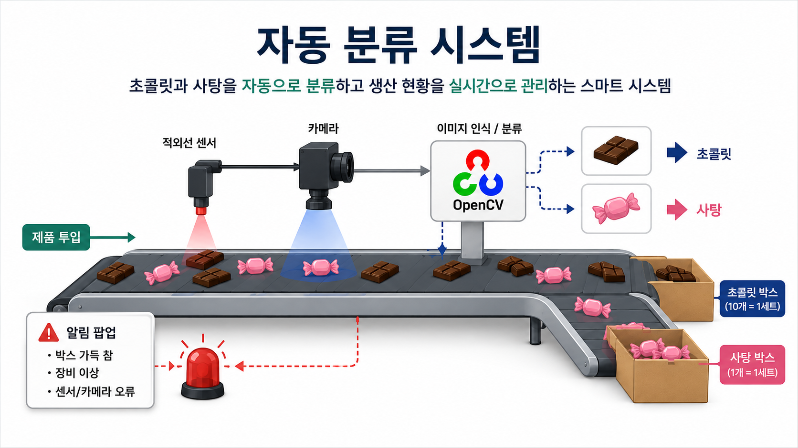
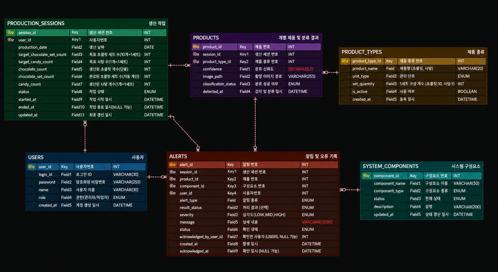
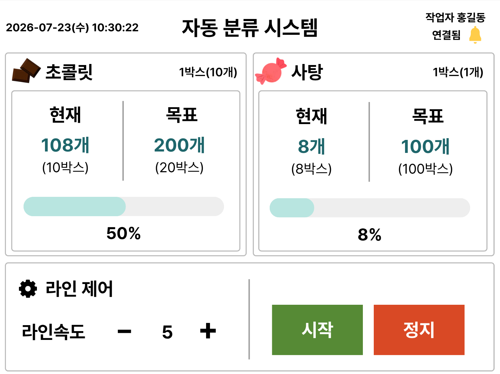

# 자동 분류 및 작업자 포장 알림 시스템

## 프로젝트 개요

- 컨베이어벨트를 통해 투입된 초콜릿과 사탕을 센서와 카메라로 감지하고, OpenCV를 이용해 자동으로 분류하는 시스템입니다.  
- 박스에 제품이 설정된 수량만큼 적재되면 작업자에게 포장 필요 알림을 제공하며, 관리자는 웹을 통해 생산 현황과 시스템 상태를 확인할 수 있습니다.

 

## Database ERD

- [ERDCloud](https://www.erdcloud.com/d/NaM6PQ2LibNW8kbbX)

- 제품 분류 결과와 생산 작업, 작업자 정보, 시스템 알림을 효율적으로 관리하기 위한 데이터베이스 구조입니다.  
- 생산 세션을 기준으로 작업자와 제품을 연결하고, 제품 및 장비에서 발생하는 알림까지 관리할 수 있도록 설계했습니다.

 

## UI 설계

### 작업자 UI

- 작업자가 현장에서 생산 상태와 진행 상황을 확인하고 컨베이어를 제어할 수 있도록 구성했습니다.  
- 제품 생산 현황과 알림을 확인하고, 필요에 따라 컨베이어를 시작·정지할 수 있습니다.

### 관리자 UI

- 관리자가 전체 생산 현황과 제품 분류 결과를 한눈에 확인할 수 있도록 웹 기반으로 구성했습니다.  
- 생산 통계, 알람 및 이상 내역, 장비 상태, 작업자별 생산 실적 등을 모니터링할 수 있습니다.