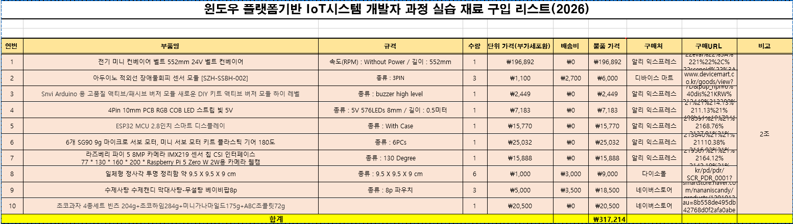

# 1주차 회의록

## 1주차 진행 내용

| 날짜 | 주요 작업 |
|---|---|
| **2026년 7월 14일** | **프로젝트 주제 확정 및 요구사항 정의서 작성** |
| **2026년 7월 15일** | **물품 리스트 작성 및 시스템 구성 검토** |
| **2026년 7월 16일** | **작업자·관리자 화면 구체화** |

---

## 2026년 7월 14일

### 1. 프로젝트 주제

#### 주제

**컨베이어벨트를 활용한 자동 분류 및 포장 알림 시스템 구축**

#### 초기 아이디어

##### 1. 재활용품 분류

* **전체 감지:** 적외선 감지 센서
* **캔:** 금속 감지 센서
* **유리병 / 페트병:** 무게 센서

##### 2. 분류 방식 나누기

* 칸막이를 이용한 분류
* 컨베이어벨트 끝의 수거통 이동 방식
* 카메라 촬영 후 데이터를 DB에 저장
* 로봇팔을 이용하여 감지된 물체를 지정된 위치로 이동
* 작업 상태 및 주의사항 알림 기능 제공

### 2. 최종 프로젝트 방향

#### 프로젝트 구성

재활용품 분류 아이디어에서 **초콜릿 및 사탕을 대상으로 한 자동 분류 및 포장 시스템**으로 프로젝트 방향을 변경하기로 결정.

#### 초기 동작 순서

1. 초콜릿(또는 사탕)을 컨베이어벨트에 투입
2. 적외선 센서로 물체 감지
3. 카메라로 이미지 촬영 및 분류
4. 분류 위치로 이동
5. 무게 측정 및 상태 알림
6. 로봇팔을 이용해 지정된 위치로 이동 및 포장

#### 주요 기능

* 데이터베이스(DB) 설계
* 사용자 UI 구현
* 초콜릿/사탕을 **n개 단위(1 Set)** 로 포장
* 포장 상자가 가득 찼을 경우

  1. 알림 신호 출력
  2. 가림막을 이용해 최대 2곳으로 분류
  3. 로봇팔을 이용해 상자 밀기
  4. 새 상자 자동 배치
* 불량품 감지
* 적외선 센서 및 무게 센서 활용
* 카메라를 이용한 제품 분류
* 생산 및 작업 상태 모니터링

### 3. 필요 물품

* 컨베이어벨트
* 변환 플러그(컨베이어벨트 전원용)
* 적외선 감지 센서
* 무게 센서
* 부저 및 LED(알림용)
* LCD 디스플레이
* 서보모터 5개(통 리필용)
* 로봇팔(적재 기능 구현 여부 검토를 위해 일단 보류)
* 웹캠
* 기타 예산(약 5만 원)
  * 통
  * 초콜릿/사탕

### 4. 요구사항 정의서 작성

프로젝트의 목적과 사용자 구분, 기능 요구사항, 비기능 요구사항 및 제외사항을 정의하였다.

#### 주요 요구사항

* 작업자와 관리자의 역할 및 접근 권한 구분
* 적외선 센서를 이용한 물체 감지
* 카메라 촬영 및 OpenCV 기반 초콜릿·사탕 분류
* 컨베이어벨트 시작·정지 및 속도 제어
* 제품 자동 분류
* 제품 적재 수량 및 생산량 집계
* 작업자용 LCD 기반 생산 현황 및 이상 감지 알림
* 관리자용 웹 기반 실시간 모니터링
* 제품 분류 결과 및 신뢰도 확인
* 생산 통계 및 생산 데이터 관리

#### 제외사항

* 로봇팔을 이용한 제품 이송 및 적재 기능은 구현 대상에서 제외한다.
* 제품을 자동으로 분류한 이후의 밀봉·포장 공정은 구현 대상에서 제외한다.
* 원격 제어 및 모바일 애플리케이션 기능은 구현 대상에서 제외한다.
* 사용자 회원가입 및 계정 관리 기능은 구현 대상에서 제외하며, 사전에 등록된 작업자 및 관리자 계정을 사용한다.
* 무게센서를 이용한 분류 기능은 구현 대상에서 제외한다.

---

### 5. 결정 사항

* 프로젝트 주제를 **재활용품 분류 시스템**에서 **초콜릿/사탕 자동 분류 및 포장 알림 시스템**으로 변경한다.
* 카메라와 적외선 센서를 활용하여 제품을 감지하고 자동으로 분류하는 방향으로 진행한다.
* 촬영 데이터 및 분류 결과를 데이터베이스에 저장하고, UI를 통해 생산 및 작업 상태를 확인할 수 있도록 개발한다.
* 초콜릿 및 사탕의 생산 수량을 세트 단위로 관리한다.
* 포장 상자가 가득 찬 경우 작업자에게 알림을 제공하는 기능을 고려한다.
* **로봇팔을 이용한 제품 이송 및 적재 기능은 구현 가능성과 프로젝트 일정을 고려하여 1주차 기준 보류한다.**
* 무게센서의 활용 여부 및 분류 기능 적용 여부는 추가 검토한 뒤, 최종적으로 분류 기능에서는 제외한다.

---

## 2026년 7월 15일

### 1. 물품 리스트 작성

프로젝트 구현에 필요한 장비 및 부품 목록을 정리하고, 전체 프로젝트 예산과 구매 우선순위를 검토하였다.

---

### 2. 2차 회의

#### 프로젝트 대상 및 분류 방식 검토

초기 아이디어로 **미니어처 캔, 병, 종이 등을 활용한 쓰레기 분류 시스템**을 검토하였으나, 최종적으로는 기존 프로젝트 방향에 따라 **초콜릿 및 사탕 분류 시스템**을 중심으로 개발하기로 하였다.

#### 제품 감지 및 분류 과정

제품의 기본적인 처리 과정은 다음과 같이 구성한다.

**적외선 센서 감지 → 카메라 촬영 → OpenCV 기반 이미지 분석 및 제품 판별**

* 적외선 센서를 이용하여 컨베이어벨트를 통과하는 제품을 감지한다.
* 제품이 감지되면 카메라를 통해 이미지를 촬영한다.
* 촬영한 이미지를 OpenCV 기반으로 분석하여 초콜릿 또는 사탕을 판별한다.
* 분류 결과와 관련 데이터를 시스템에 전달하고 저장한다.

---

### 3. 시스템 구성 검토

카메라 기반 제품 분류를 위해 **아두이노와 라즈베리파이를 연동하는 구조**를 검토하였다.

#### 예상 데이터 처리 흐름

**센서 감지 → 라즈베리파이에서 이미지 촬영 → 이미지 분석 및 제품 분류 → 윈도우 서버로 데이터 전달**

* 아두이노에서 센서 값을 수집한다.
* 센서 감지 결과를 라즈베리파이에 전달한다.
* 라즈베리파이에서 카메라를 이용하여 제품 이미지를 촬영한다.
* 촬영된 이미지와 센서 정보를 활용하여 제품을 판별한다.
* 분류 결과 및 필요한 정보를 윈도우 서버로 전달한다.
* 전달된 데이터는 모니터링 및 생산 현황 관리에 활용한다.

---

### 4. 데이터 및 통신 방식 검토

* 카메라에서 촬영한 이미지와 센서 데이터를 시스템 간 전달할 수 있도록 구성한다.
* 이미지 및 센서 데이터를 활용하여 제품 분류에 필요한 유의미한 정보를 생성한다.
* 실시간 모니터링을 위해 이미지 또는 영상 데이터를 웹 기반 화면으로 전달하는 방안을 검토한다.
* 시스템 간 데이터 전달 및 실시간 통신 방식은 프로젝트 구현 환경에 맞춰 추가 검토한다.

---

### 5. 시스템 모니터링 및 역할 분담

* 작업자와 관리자의 역할을 구분하여 시스템을 구성한다.
* 작업자는 생산 현장에서 LCD 기반 화면을 통해 생산 현황과 이상 상황을 확인한다.
* 관리자는 웹 기반 화면을 통해 전체 생산 현황과 제품 분류 결과를 모니터링한다.
* 시스템 구현 및 개발 역할을 분담하여 프로젝트를 진행한다.

---

### 6. 일정 및 예산 검토

* 프로젝트 진행에 필요한 물품을 1차와 2차로 나누어 구매하는 방안을 검토한다.
* 전체 예산은 약 **50만 원 수준**으로 계획한다.
* 프로젝트 발표를 위한 PT 자료를 준비한다.
* 세부 프로젝트 일정은 추후 정리하여 공유하기로 한다.
* **9월 중순 이전까지 프로젝트 구현 및 결과물 완성을 목표로 한다.**

---

### 7. 결정 사항

* 제품 감지는 **적외선 센서**, 제품 분류는 **카메라 및 OpenCV 기반 이미지 분석**을 활용하는 방향으로 진행한다.
* 아두이노는 센서 데이터를 수집하고, 라즈베리파이는 카메라 촬영 및 이미지 처리 역할을 담당하는 구조를 검토한다.
* 제품 이미지 및 분류 결과는 윈도우 서버와 연계하여 관리한다.
* 작업자용 화면과 관리자용 웹 모니터링 화면을 구분하여 구현한다.
* 실시간 데이터 및 이미지 전달을 위한 통신 방식을 추가 검토한다.
* 프로젝트 일정은 **9월 중순 이전 완료**를 목표로 한다.

---

## 2026년 7월 16일

### 1. 작업자용 페이지 구성 검토

생산 현장에서 작업자가 현재 생산 상태와 이상 상황을 직관적으로 확인할 수 있도록 **LCD 기반 작업자용 UI**를 구성하기로 하였다.

#### 주요 표시 정보

* 현재 날짜
* 생산 중인 제품 종류
* 생산된 초콜릿 개수
* 생산된 사탕 개수
* 목표 생산량
* 총 생산량
* 완료된 1 Set 수량
* 생산 작업 상태
* 이상 감지 및 오류 알림

#### 컨트롤러 기능

* 컨베이어벨트 라인 속도 조절
* 생산 작업 상태 확인
* 이상 상황 발생 시 알림 확인

---

### 2. 관리자용 페이지 구성 검토

관리자가 생산 현황과 제품 분류 결과를 웹에서 실시간으로 확인할 수 있도록 **관리자용 웹 모니터링 페이지**를 구성하기로 하였다.

#### 제품 분류 결과

* 카메라를 통해 제품 이미지를 촬영한다.
* OpenCV 기반 이미지 분석을 통해 초콜릿 또는 사탕을 판별한다.
* 제품별 분류 결과와 AI 분류 신뢰도를 확인할 수 있도록 구성한다.
* 촬영 이미지 및 분류 결과를 관리자가 확인할 수 있도록 한다.

#### 생산 현황 모니터링

* 목표 생산량 확인
* 총 생산량 확인
* 초콜릿 생산량 확인
* 사탕 생산량 확인
* 1 Set 완료 현황 확인
* 생산량 그래프를 통한 실시간 현황 확인

---

### 3. 알림 및 이상 감지 기능

생산 과정에서 발생하는 이상 상황을 작업자와 관리자에게 전달할 수 있도록 알림 기능을 구성하기로 하였다.

* 제품 분류 오류 감지
* 센서 이상 감지
* 카메라 및 이미지 분석 오류 감지
* 컨베이어벨트 관련 이상 상황 감지
* 시스템 구성요소별 오류 상태 관리
* 오류 발생 시 작업자 및 관리자에게 알림 제공

---

### 4. 시스템 화면 구성 방향

프로젝트의 사용자 화면을 **작업자용 LCD UI**와 **관리자용 웹 모니터링 화면**으로 구분하여 구성한다.

#### 작업자용 LCD UI

**생산 현장 중심**

* 생산량 확인
* 목표량 확인
* 1 Set 완료 확인
* 컨베이어벨트 상태 확인
* 이상 감지 및 알림 확인

#### 관리자용 웹 UI

**생산 관리 및 모니터링 중심**

* 제품 분류 결과 확인
* 촬영 이미지 확인
* 분류 신뢰도 확인
* 목표 대비 생산량 확인
* 생산량 그래프 확인
* 오류 및 알림 이력 확인
* 시스템 구성요소 상태 확인

---

### 5. 결정 사항

* 작업자용 화면은 **LCD 기반 HMI** 형태로 구성한다.
* 관리자용 화면은 **웹 기반 모니터링 시스템**으로 구성한다.
* 제품 분류는 카메라 촬영 후 OpenCV 기반 이미지 분석을 통해 수행한다.
* 제품 분류 결과에는 **분류 신뢰도와 촬영 이미지 정보**를 함께 관리한다.
* 생산 목표량과 실제 생산량을 비교하여 관리자 화면에서 확인할 수 있도록 한다.
* 초콜릿은 **10개를 1 Set**으로 관리하고, 사탕은 **1개를 1 Set**으로 관리한다.
* 생산 과정에서 발생하는 센서, 컨베이어, 카메라, AI 관련 오류를 감지하고 알림으로 관리하는 방향으로 구성한다.
* 작업자와 관리자의 역할에 따라 필요한 정보를 분리하여 제공한다.

---

## 1주차 종합 결정 사항

* 최종 프로젝트는 **컨베이어벨트를 활용한 초콜릿 및 사탕 자동 분류 및 포장 알림 시스템**으로 진행한다.
* 적외선 센서로 제품을 감지하고, 카메라 촬영 후 OpenCV 기반 이미지 분석을 통해 제품을 분류한다.
* 생산 데이터와 제품 분류 결과를 데이터베이스에 저장하고, 생산 작업 단위로 관리한다.
* 초콜릿은 **10개 = 1 Set**, 사탕은 **1개 = 1 Set** 기준으로 생산량을 관리한다.
* 작업자는 LCD 기반 HMI를 통해 생산 현황 및 이상 상황을 확인한다.
* 관리자는 웹 기반 모니터링 화면을 통해 생산량, 제품 분류 결과, 이미지 및 오류 정보를 확인한다.
* 제품 분류 이후 실제 밀봉 및 포장은 작업자가 수행하며, 시스템은 **포장 시점 및 작업 필요 상황을 작업자에게 알림**으로 제공하는 방향으로 구성한다.
* 로봇팔을 이용한 제품 이송 및 적재 기능은 **1주차에서 구현 여부를 검토했으나, 프로젝트 범위와 일정 등을 고려하여 우선 보류**한다.
* 무게센서는 초기에는 분류 기능에 활용하는 방안을 검토했으나, 최종 구현 범위에서는 제외한다.
* 원격 제어 및 모바일 애플리케이션은 구현 대상에서 제외한다.
* 사용자 회원가입 기능은 구현하지 않고, 사전에 등록된 작업자 및 관리자 계정을 사용한다.
* 전체 프로젝트는 **2026년 9월 중순 이전 완료**를 목표로 진행한다.
