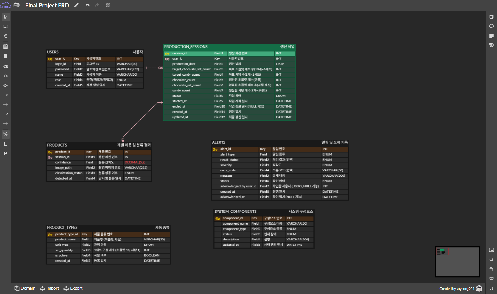

# 2주차 회의록

## 2026년 7월 20일

### 1. 요구사항 정의서 수정

#### 프로젝트 목적 수정
- 프로젝트 목적을 "자동 분류 및 포장 시스템"에서 **자동 분류 및 작업자 포장 알림 시스템**으로 수정
- 실제 포장 기능은 구현하지 않고, 박스 적재 완료 시 작업자에게 포장을 요청하는 방식으로 변경

#### 기능 요구사항 보완
- 작업자 및 관리자 로그인 기능 추가
- 작업자/관리자 권한 구분 기능 추가
- 박스 적재 완료 감지 기능 추가
- 서보모터를 이용한 박스 배출 기능 추가
- LCD, LED, 부저를 이용한 작업자 알림 기능 추가
- 작업자 UI 및 관리자 웹 기능 보완
- 비기능 요구사항 및 제외사항 수정

---

### 2. 데이터베이스 설계

#### 테이블 구성

프로젝트 기능을 기반으로 다음 4개의 테이블을 설계하였다.

- USER
- PRODUCT
- PRODUCTION
- ALERT

#### USER

- 작업자 및 관리자 계정 관리
- 로그인 및 권한(Role) 관리

#### PRODUCT

- OpenCV를 이용한 제품 분류 결과 저장
- 제품 종류, 신뢰도, 이미지 경로, 분류 시간 저장
- 로그인한 작업자 정보를 함께 저장하여 작업자별 생산 실적 관리 가능하도록 설계

#### PRODUCTION

- 날짜별 목표 생산량 관리
- 초콜릿 및 사탕 생산량 관리
- 완료된 초콜릿 세트 수 관리
- 작업자별 생산 현황 관리

#### ALERT

- 센서, 컨베이어, 카메라, OpenCV 오류 저장
- 오류 종류 및 오류 내용 저장
- 오류 처리 여부 관리
- PRODUCT와 연결하여 오류 발생 제품 및 담당 작업자 확인 가능하도록 설계

---

### 3. 테이블 관계 검토

#### USER → PRODUCT
- 작업자별 생산 실적 관리
- 오류 발생 시 담당 작업자 조회

#### USER → PRODUCTION
- 작업자별 생산 현황 및 목표 생산량 관리

#### PRODUCT → ALERT
- 제품 분류 과정에서 발생한 오류 관리
- 제품 1개당 최대 1개의 오류 정보 저장

#### PRODUCT ↔ PRODUCTION
- 생산 현황은 집계 데이터, 제품은 상세 데이터로 역할을 구분
- 직접 관계를 두지 않고 필요 시 날짜를 기준으로 조회하는 방향으로 결정

---

### 4. 설계 방향

- 작업자별 생산 실적 조회 가능하도록 설계
- 오류 발생 시 담당 작업자를 확인할 수 있도록 설계
- 데이터 중복을 최소화하는 방향으로 테이블 구성
- 모든 관계는 Non-Identifying Relationship(점선)으로 설계

---

### 5. 향후 작업

- ERD 작성
- 테이블 관계 최종 검토
- UI 화면 설계
- DB 구현


## 2026년 7월 21일

### 1. 회의 개요



- [링크](https://www.erdcloud.com/d/NaM6PQ2LibNW8kbbX)
- **회의 주제:** 초콜릿·사탕 자동 분류 시스템 ERD 설계 검토 및 수정
- **주요 목표:** 생산 작업, 제품 분류 결과, 작업자 실적, 시스템 알림을 관리할 수 있는 데이터베이스 구조 확정

---

### 2. 프로젝트 핵심 내용

본 프로젝트는 컨베이어벨트에 투입된 초콜릿과 사탕을 적외선 센서와 카메라로 감지한 후 OpenCV를 이용하여 자동 분류하는 시스템이다.

분류된 제품의 생산량을 실시간으로 집계하고, 박스가 설정된 수량만큼 채워지면 서보모터를 통해 박스를 배출한다. 이후 LCD, LED, 부저를 이용하여 작업자에게 박스 교체 및 포장 알림을 제공한다.

작업자는 LCD를 통해 생산 현황과 이상 상황을 확인하고, 관리자는 웹 페이지에서 생산량, 분류 결과, 신뢰도, 시스템 상태 및 오류 기록을 확인한다.

#### 제품 관리 기준

- 초콜릿: **10개 = 1세트**
- 사탕: **1개 = 1세트(단품)**

---

### 3. 초기 ERD 설계

초기에는 다음 4개 테이블을 중심으로 설계하였다.

1. `USERS`
2. `PRODUCTS`
3. `PRODUCTION`
4. `ALERTS`

초기 관계는 다음과 같이 구성하였다.

```text
USERS 1:N PRODUCTS
USERS 1:N PRODUCTION
PRODUCTS 1:0..1 ALERTS
```

그러나 다음과 같은 문제점이 확인되었다.

- 제품은 시스템이 자동으로 분류하지만 `PRODUCTS`에 작업자를 직접 연결하고 있었음
- 제품이 없는 상황에서도 센서, 카메라, 컨베이어, DB 오류가 발생할 수 있음
- 하나의 제품에서 여러 오류가 발생할 수 있으나 `ALERTS.product_id`에 UNIQUE 제약을 고려하고 있었음
- 날짜만으로 제품과 생산 작업을 연결하면 동일 날짜의 여러 작업을 구분하기 어려움
- 작업자별 생산 실적과 오류 발생 당시 담당 작업자를 정확하게 추적하기 어려움

---

### 4. 생산 세션 테이블 도입

작업자가 실제로 생산 라인을 운영한 단위를 관리하기 위해 `PRODUCTION_SESSIONS` 테이블을 도입하기로 하였다.

제품과 작업자를 직접 연결하지 않고 다음과 같은 관계를 사용한다.

```text
USERS
  1
  │
  N
PRODUCTION_SESSIONS
  1
  │
  N
PRODUCTS
```

#### 도입 목적

- 작업자별 생산 실적 관리
- 작업 시작 및 종료 시각 관리
- 같은 날짜에 수행된 여러 작업 구분
- 오류 발생 당시 생산 라인을 운영한 작업자 확인
- 제품이 어느 생산 작업에서 처리되었는지 추적

작업자 확인 경로는 다음과 같다.

```text
PRODUCTS
→ PRODUCTION_SESSIONS
→ USERS
```

오류 발생 당시 작업자 확인 경로는 다음과 같다.

```text
ALERTS
→ PRODUCTION_SESSIONS
→ USERS
```

---

### 5. 알림 및 오류 테이블 검토

`ALERTS`는 특정 제품 오류뿐 아니라 생산 완료, 박스 적재 완료, 장비 오류, 소프트웨어 오류를 통합 관리한다.

### 알림 예시

- 적외선 센서 응답 없음
- 카메라 촬영 실패
- OpenCV 제품 분류 실패
- 컨베이어 구동 실패
- 서보모터 박스 배출 실패
- 데이터베이스 연결 및 저장 실패
- 박스 가득 참
- 목표 생산량 완료

모든 알림이 특정 제품과 관련된 것은 아니므로 다음 FK는 NULL을 허용한다.

```text
session_id
component_id
product_id
```

#### 관계

```text
PRODUCTION_SESSIONS 1:0..N ALERTS
PRODUCTS 1:0..N ALERTS
SYSTEM_COMPONENTS 1:0..N ALERTS
```

하나의 제품에서 여러 오류가 발생할 수 있으므로 `ALERTS.product_id`에는 UNIQUE 제약을 적용하지 않는다.

---

### 6. 시스템 구성요소 관리

센서와 장비뿐 아니라 소프트웨어와 DB 오류까지 통합 관리하기 위해 `SYSTEM_COMPONENTS` 테이블을 사용한다.

#### 구성요소 예시

- 적외선 센서
- 분류 카메라
- 컨베이어 모터
- 분류용 서보모터
- 박스 배출 서보모터
- OpenCV 분류 모듈
- 관리자 웹 서버
- 생산 데이터베이스

구성요소 종류는 다음과 같이 구분한다.

```text
SENSOR
CAMERA
CONVEYOR
MOTOR
SOFTWARE
DATABASE
```

---

### 7. PRODUCT_TYPES 테이블

제품 종류와 세트 구성 기준을 관리하기 위해 `PRODUCT_TYPES` 테이블을 사용한다.

| 제품 | 관리 단위 | 1세트 구성 수량 |
|---|---|---:|
| 초콜릿 | SET | 10 |
| 사탕 | SINGLE | 1 |

주요 컬럼은 다음과 같다.

```text
product_type_id
product_name
unit_type
set_quantity
is_active
created_at
```

`PRODUCT_TYPES`는 개별 분류 결과인 `PRODUCTS`와 연결한다.

```text
PRODUCT_TYPES 1:N PRODUCTS
```

---

### 8. 생산량 테이블 관련 피드백

기존에는 `PRODUCTION_COUNTS` 테이블을 별도로 구성하여 생산 세션별·제품 종류별 생산량을 관리하려고 하였다.

기존 구조는 다음과 같았다.

```text
PRODUCTION_COUNTS
- production_count_id
- session_id
- product_type_id
- target_quantity
- actual_quantity
- completed_set_count
```

회의 및 피드백에서 다음 의견을 받았다.

1. `PRODUCTION_COUNTS`와 `ALERTS`의 직접 연결은 필요 없음
2. `PRODUCTS`와 `ALERTS`의 연결은 필요함
3. `PRODUCTION_COUNTS`의 `product_type_id`는 현재 구조에서 불필요함
4. `PRODUCTION_COUNTS`의 컬럼을 `PRODUCTION_SESSIONS`로 통합할 수 있음

---

### 9. 피드백 반영 결과

현재 프로젝트의 제품 종류가 초콜릿과 사탕으로 고정되어 있고, 구현 난이도를 줄이는 것이 중요하므로 `PRODUCTION_COUNTS` 테이블을 삭제하기로 하였다.

생산량 관련 컬럼은 `PRODUCTION_SESSIONS`로 이동한다.

#### 수정된 PRODUCTION_SESSIONS

```text
PRODUCTION_SESSIONS
- session_id PK
- user_id FK
- production_date
- target_chocolate_set_count
- target_candy_count
- chocolate_count
- chocolate_set_count
- candy_count
- status
- started_at
- ended_at
- created_at
- updated_at
```

#### 생산량 관리 기준

```text
초콜릿 완료 세트 수 = chocolate_count DIV 10
사탕 생산 실적 = candy_count
```

사탕은 단품 기준이므로 별도의 `candy_set_count`를 두지 않고 `candy_count`를 사용한다.

---

### 10. 최종 테이블 구성

피드백 반영 후 총 6개 테이블로 설계한다.

1. `USERS`
2. `PRODUCTION_SESSIONS`
3. `PRODUCT_TYPES`
4. `PRODUCTS`
5. `SYSTEM_COMPONENTS`
6. `ALERTS`

---

### 11. 최종 테이블별 역할

#### USERS

작업자와 관리자의 로그인 정보 및 권한을 관리한다.

```text
USERS
- user_id PK
- login_id UNIQUE
- password
- name
- role
- created_at
```

#### PRODUCTION_SESSIONS

작업자가 생산 라인을 운영한 작업 단위와 목표 및 실제 생산량을 관리한다.

```text
PRODUCTION_SESSIONS
- session_id PK
- user_id FK
- production_date
- target_chocolate_set_count
- target_candy_count
- chocolate_count
- chocolate_set_count
- candy_count
- status
- started_at
- ended_at
- created_at
- updated_at
```

#### PRODUCT_TYPES

분류 대상 제품의 이름, 관리 단위, 세트 구성 수량을 관리한다.

```text
PRODUCT_TYPES
- product_type_id PK
- product_name
- unit_type
- set_quantity
- is_active
- created_at
```

#### PRODUCTS

컨베이어에서 감지된 개별 제품의 이미지와 OpenCV 분류 결과를 저장한다.

```text
PRODUCTS
- product_id PK
- session_id FK
- product_type_id FK NULL
- confidence
- image_path
- classification_status
- detected_at
```

분류에 실패한 경우 `product_type_id`는 NULL을 허용한다.

#### SYSTEM_COMPONENTS

센서, 카메라, 컨베이어, 모터, 소프트웨어, DB 등의 시스템 구성요소와 현재 상태를 관리한다.

```text
SYSTEM_COMPONENTS
- component_id PK
- component_name
- component_type
- status
- description
- updated_at
```

#### ALERTS

생산 완료, 박스 가득 참, 제품 분류 실패, 장비 및 시스템 오류를 저장한다.

```text
ALERTS
- alert_id PK
- session_id FK NULL
- component_id FK NULL
- product_id FK NULL
- alert_type
- result_status
- severity
- error_code
- message
- status
- acknowledged_by_user_id FK NULL
- created_at
- acknowledged_at
```

`acknowledged_by_user_id`는 오류 발생 당시 담당 작업자가 아니라 알림을 실제로 확인한 사용자를 의미한다.

---

### 12. 최종 테이블 관계

```text
USERS 1 ───── 0..N PRODUCTION_SESSIONS

PRODUCTION_SESSIONS 1 ───── 0..N PRODUCTS
PRODUCT_TYPES       1 ───── 0..N PRODUCTS

PRODUCTION_SESSIONS 1 ───── 0..N ALERTS
PRODUCTS            1 ───── 0..N ALERTS
SYSTEM_COMPONENTS   1 ───── 0..N ALERTS

USERS               1 ───── 0..N ALERTS
                         acknowledged_by_user_id 기준
```

---

### 13. 식별 관계 및 비식별 관계

현재 모든 자식 테이블은 독립적인 PK를 가지고 있으며, 부모 테이블의 PK는 자식 테이블의 FK로만 사용한다.

예시:

```text
PRODUCTS
- product_id PK
- session_id FK
- product_type_id FK
```

부모 PK가 자식 PK에 포함되지 않으므로 현재 관계는 모두 비식별 관계이다.

ERD에서는 점선으로 표현한다.

---

### 14. 최종 결정 사항

- `PRODUCTS.user_id`를 사용하지 않고 `session_id`를 통해 담당 작업자를 추적한다.
- `PRODUCTION_SESSIONS`를 작업자 및 생산 데이터의 기준 테이블로 사용한다.
- `PRODUCTS`와 `ALERTS`는 연결한다.
- `ALERTS.product_id`는 NULL을 허용하고 UNIQUE 제약은 적용하지 않는다.
- 제품과 관계없는 오류도 저장할 수 있도록 `ALERTS`를 `PRODUCTION_SESSIONS`, `SYSTEM_COMPONENTS`와 연결한다.
- `PRODUCTION_COUNTS` 테이블은 삭제한다.
- 생산량 관련 컬럼은 `PRODUCTION_SESSIONS`로 통합한다.
- 초콜릿은 10개를 1세트로 계산한다.
- 사탕은 단품 생산량으로 관리한다.
- 최종 ERD는 6개 테이블로 구성한다.

---

### 15. 추후 작업

- 최종 ERD 관계선 및 카디널리티 수정
- MySQL 테이블 생성 SQL 작성
- ENUM 또는 코드값 관리 방식 결정
- 생산량 증가 및 세트 수 계산 로직 구현
- 제품 분류 실패 시 PRODUCT 저장 방식 결정
- 알림 확인 처리 기능 구현
- 관리자 웹의 작업자별 생산 실적 조회 쿼리 작성

