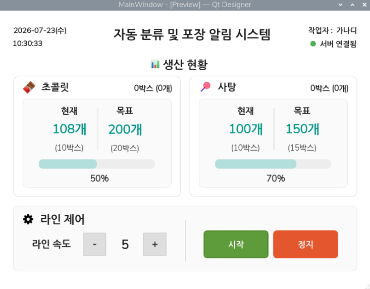
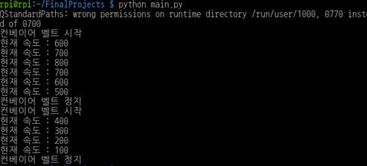

# 4주차 회의록

## 2026년 8월 3일 월요일

### 작업자 UI 디자인

#### 작업 내용

- Qt Designer를 활용하여 작업자용 HMI UI 레이아웃 구성
- 생산 현황(초콜릿·사탕) 카드 UI 설계 및 정보 배치
- 현재/목표 생산량, 박스 수, 진행률(ProgressBar) 표시 구현
- 제품 및 설정 아이콘 추가, 카드 내부 Frame 적용
- 라인 제어 영역(속도 조절, 시작/정지 버튼) UI 구성
- 전체 정렬, 간격, 색상 등 UI 디자인 개선

#### 다음 작업

- UI와 main.py 연동
- 버튼 이벤트 및 라인 속도 제어 구현
- 생산량·진행률 실시간 갱신
- MQTT 기반 생산 데이터 연동

## 2026년 8월 4일 화요일

### 작업자 HMI 기능 구현

작업 내용

- `worker_main.ui`와 `main.py` 연동
- 날짜·시간 실시간 표시(QTimer) 기능 구현
- Start / Stop 버튼 이벤트 및 속도 제어 기능 구현
- 속도 단계(1~10)와 실제 모터 속도(100~1000) 분리 설계
- Start/Stop에 따른 속도 조절 버튼 활성화/비활성화 구현

#### 다음 작업

- 컨베이어 동작 상태(isRunning) 관리 구현
- 생산량 및 ProgressBar 실시간 갱신
- Raspberry Pi · Arduino Serial(MQTT) 연동
- 컨베이어 Start / Stop / Speed 제어 구현
